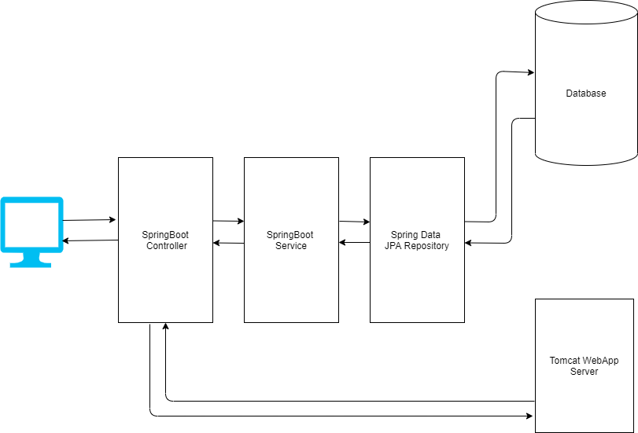

# eCommerce Java Back-end Project

Back-end project! Java Spring Boot in the back-end.
Spring Boot, Hibernate, REST, H2 DB

* Deploy domain models
* Object-relational mapping with JPA
* Data Access with Spring Data
* Layered Development
* REST API creation with JSON serialization
* Use-case: E-Commerce Backend based development

#APIs
1. Enabling User to be able to see products.

URI: /products

Method: HTTP GET

Response Body Schema: 
<pre>
<code>
{
  "type": "array",
  "items": [
    {
      "type": "object",
      "properties": {
        "name": {
          "type": "string"
        },
        "price": {
          "type": "number"
        },
        "seller": {
          "type": "object",
          "properties": {
            "name": {
              "type": "string"
            },
            "email": {
              "type": "string"
            },
            "address": {
              "type": "string"
            }
          },
          "required": [
            "name",
            "email",
            "address"
          ]
        },
        "category": {
          "type": "string"
        }
      },
      "required": [
        "name",
        "price",
        "seller",
        "category"
      ]
    }
  ]
}
</code>
</pre>

Response Body Example:
<pre>
<code>
[
    {
        "name": "Computer",
        "price": 1800.0,
        "seller": {
            "name": "seller1",
            "email": "seller@seller.com",
            "address": "haha"
        },
        "category": "electronics"
    },
    {
        "name": "MacBook",
        "price": 2800.0,
        "seller": {
            "name": "seller1",
            "email": "seller@seller.com",
            "address": "haha"
        },
        "category": "electronics"
    },
    {
        "name": "Ipad",
        "price": 400.0,
        "seller": {
            "name": "seller1",
            "email": "seller@seller.com",
            "address": "haha"
        },
        "category": "electronics"
    }
]
</code>
</pre>

2. Seller to be able to post products. 

URI: products/addProduct

Method: HTTP POST

Request Body Schema:
<pre>
<code>
{
  "type": "array",
  "items": [
    {
      "type": "object",
      "properties": {
        "name": {
          "type": "string"
        },
        "price": {
          "type": "number"
        },
        "seller": {
          "type": "object",
          "properties": {
            "name": {
              "type": "string"
            },
            "email": {
              "type": "string"
            },
            "address": {
              "type": "string"
            }
          },
          "required": [
            "name",
            "email",
            "address"
          ]
        }
      },
      "required": [
        "name",
        "price",
        "seller"
      ]
    }
  ]
}
</code>
</pre>

Request Body Example:
<pre>
<code>
[{
            "name": "lenovo",
            "price": 48290.00,
            "seller": {
                "name": "Raghav Patil",
                "email": "raghav.patil@seller.com",
                "address": "32 street, Baner, Pune"
            }
}]
</code>
</pre>

Response Body Schema:
<pre>
<code>
{
  "type": "object",
  "properties": {
    "message": {
      "type": "string"
    }
  },
  "required": [
    "message"
  ]
}
</code>
</pre>

Response Body Example:
<pre>
<code>
{
    "message": "Product(s) successfully added to Inventory"
}
</code>
</pre>

3. User to be able to add products to cart.

URI: /cart/addProduct/{clientId}/{productId}

Method: HTTP PUT

Request Body: Empty

Response Body Schema: 

<pre>
<code>
{
  "type": "object",
  "properties": {
    "id": {
      "type": "integer"
    },
    "cartContents": {
      "type": "array",
      "items": [
        {
          "type": "object",
          "properties": {
            "name": {
              "type": "string"
            },
            "price": {
              "type": "number"
            },
            "seller": {
              "type": "object",
              "properties": {
                "name": {
                  "type": "string"
                },
                "email": {
                  "type": "string"
                },
                "address": {
                  "type": "string"
                }
              },
              "required": [
                "name",
                "email",
                "address"
              ]
            },
            "category": {
              "type": "string"
            }
          }
        }
      ]
    },
    "productQuantityMap": {
      "type": "object",
      "properties": {
        "1": {
          "type": "integer"
        }
      }
    }
  }
}
</code>
</pre>

Response Body Example:
<pre>
<code>
{
    "id": 1,
    "cartContents": [
        {
            "name": "Computer",
            "price": 1800.0,
            "seller": {
                "name": "Raghav Patil",
                "email": "raghav.patil@seller.com",
                "address": "32, baner street, Pune"
            },
            "category": "electronics"
        }
    ],
    "productQuantityMap": {
        "1": 3
    }
}
</code>
</pre>

4. User to be able to place an order by making payment. 

URI: /orders/placeOrder/{clientId}/{paymentMode}

Method: HTTP PUT

Request Body: Empty

Response Body Schema:
<pre>
<code>
{
  "type": "object",
  "properties": {
    "orderTotalValue": {
      "type": "number"
    },
    "paymentMode": {
      "type": "string"
    },
    "clientId": {
      "type": "integer"
    },
    "deliveryDate": {
      "type": "string"
    },
    "paymentStatus": {
      "type": "string"
    },
    "orderStatus": {
      "type": "string"
    }
  }
}
</code>
</pre>

Response Body Example:
<pre>
<code>
{
    "orderTotalValue": 5400.0,
    "paymentMode": "COD",
    "clientId": 1,
    "deliveryDate": "20/05/2021",
    "paymentStatus": "PENDING",
    "orderStatus": "PLACED"
}
</code>
</pre>
#Service Architecture
 